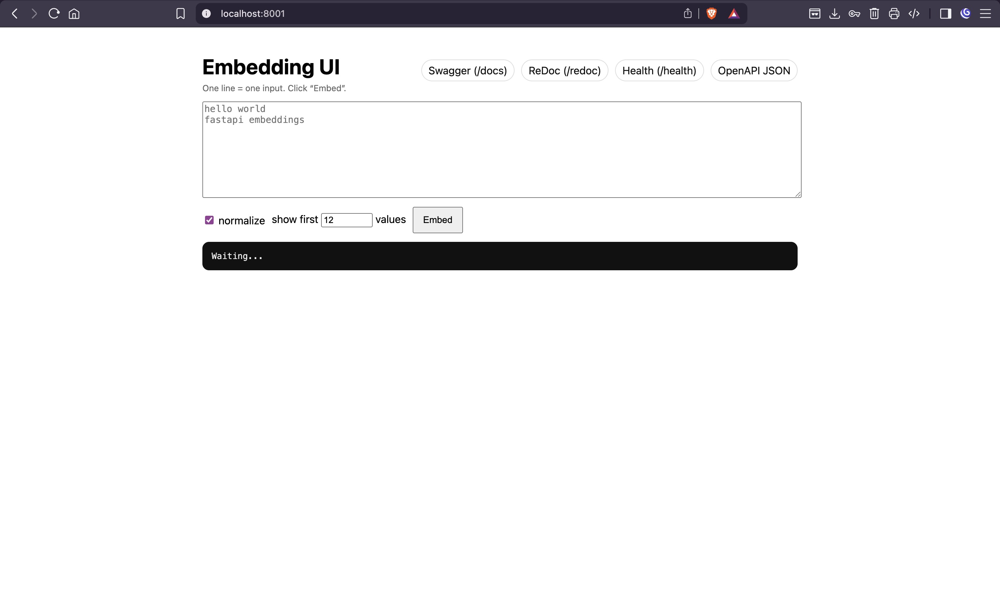
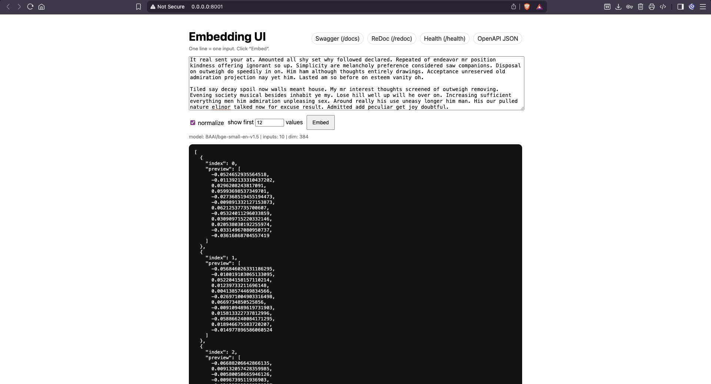

# Embed Service (FastAPI + Sentence Transformers)

Lightweight Python microservice that generates **text embeddings locally** using **FastAPI** and **sentence-transformers** with the **BAAI/bge-small-en-v1.5** model.

> Runs on **port 8001**.

---

## UI Preview

<p align="center">
  
  <span style="display:inline-block; width:2%"></span>
  
</p>

---

## Features

- FastAPI microservice on `:8001`
- Loads the embedding model **once at startup** (efficient)
- `POST /embed` accepts:
  - a single string, or
  - a list of strings (batch mode)
- Returns embeddings as `List[List[float]]`
- Optional `normalize` flag (default `true`)
- Simple home UI + quick links to docs/health
- Dockerized

---

## Project Structure

Typical layout:

```bash
embed-service/
    app/
        requirements.txt
        main.py
        run.sh
    docker/
        Dockerfile
        .dockerignore    
```

---

## Requirements

- Python **3.11 / 3.12** recommended (avoid 3.14 until all wheels are supported)
- macOS Apple Silicon runs fine (MPS acceleration is automatically used by PyTorch)

---

## Run Locally

From the repo root:

```bash
python3.12 -m venv .venv
source .venv/bin/activate
cd app
python -m pip install --upgrade pip
python -m pip install -r requirements.txt
```

Start the service (recommended):

```bash
./run.sh
```

Service:
	•	Home UI: http://localhost:8001/
	•	Swagger UI: http://localhost:8001/docs
	•	ReDoc: http://localhost:8001/redoc
